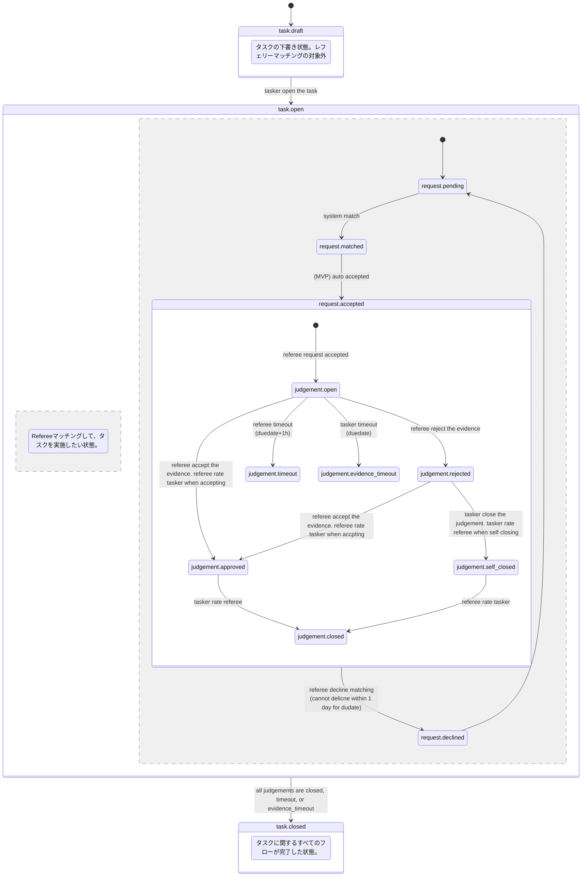

# PepperCheck: Design Document

## 開発方針

### MVPファースト
- コア機能を最優先で実装
- 不要な機能は後回し
- 機能対行数の比率を最大化
- 迅速なイテレーション

### 品質保証
- テスト駆動開発
- 継続的インテグレーション
- 自動化されたテスト

### セキュリティ
- 認証・認可の徹底
- データベースのRLS保護
- データ暗号化
- セキュアな支払い処理
- 定期的なセキュリティ監査

## 技術選定

### フロントエンド
- Device: Android
  - 言語: Kotlin
  - UIフレームワーク: Jetpack Compose
  - MVPではAndroidに限定して実装する。iOSはAndroidが実装できたら開発を開始する

### バックエンド
- Platform: Supabase
  - データベース: Supabase PostgreSQL
  - 認証: Supabase Auth

### ストレージ
- データベース: Supabase PostgreSQL
- ファイルストレージ: Cloudflare R2
  - Supabase Storageと比較して、Cloudflare R2のほうが値段が抑えられそうなため

### 外部サービス
- 支払い/出金: Stripe
  - お金に関する処理はStripeのみで完結させる。PepperCheckとしてはお金を預からないようにする
- 認証: Google Sign-in
  - メールアドレスとパスワードなど他の認証方法は使わずGoogle認証に限定する。実装速度とセキュリティの両立のため
- ホスティング: Cloudflare Workers
  - ランディングページのホスティングやAPIを独自ドメインで公開するため

## Status定義仕様

### 概要
PepperCheckシステムにおける各エンティティのstatus定義とライフサイクル管理。

### tasks.status

| Status | 説明 | 次の状態 |
|--------|------|----------|
| `draft` | タスク作成直後の下書き状態。レフェリーマッチング対象外 | `open` |
| `open` | refereeマッチングを望む状態。evidence提出とjudgement並行実行 | `closed` |
| `closed` | 全judgementが完了（closed/timeout/evidence_timeout）したタスク終了状態 | - |

**遷移フロー**: 
- 通常: `draft` → `open` → `closed`
- 完了条件: 全judgementが終了状態（closed/timeout/evidence_timeout）に到達

**注記**: task.openは複雑な内部状態を持つ複合状態。実際の進行状況は関連エンティティ（request/judgement）の状態で判定。

#### 状態遷移図



**詳細設計**: 
- [タスク完了フロー設計](functions/task-completion.md)
- [評価システム設計](functions/rating.md)

### judgements.status

| Status | 説明 | 次の状態 | 評価タイミング |
|--------|------|----------|----------------|
| `open` | レフェリーが受諾してタスクに割り当てられた初期状態 | `approved`, `rejected`, `timeout`, `evidence_timeout` | - |
| `approved` | レフェリーがタスク完了を承認。相互評価待ち状態 | `closed` | referee→tasker評価済み |
| `rejected` | レフェリーがタスク未完了と判定。Tasker対応待ち | `approved`, `self_closed` | - |
| `self_closed` | Taskerが強制完了。Referee評価待ち状態 | `closed` | tasker→referee評価済み |
| `closed` | 相互評価完了済みの最終完了状態 | - | 全評価完了 |
| `timeout` | レフェリータイムアウトによる自動終了状態 | - | 評価なし |
| `evidence_timeout` | Taskerタイムアウトによる自動終了状態 | - | 評価なし |

**遷移フロー**: 
- 通常承認: `open` → `approved` → `closed`
- 拒否後承認: `open` → `rejected` → `approved` → `closed`
- 強制完了: `rejected` → `self_closed` → `closed`
- Refereeタイムアウト: `open` → `timeout`
- Taskerタイムアウト: `open` → `evidence_timeout`

**評価システム統合**:
- `approved`遷移時: referee → tasker評価実行
- `self_closed`遷移時: tasker → referee評価実行  
- `closed`遷移時: 最後の評価者による評価実行

### task_referee_requests.status

| Status | 説明 | 次の状態 |
|--------|------|----------|
| `pending` | マッチングリクエスト作成直後、レフェリー割り当て待ち | `matched` |
| `matched` | マッチングアルゴリズムでレフェリー発見、応答待ち | `accepted`, `declined` |
| `accepted` | レフェリーが依頼受諾、judgement作成される | - |
| `declined` | レフェリーが依頼辞退、再マッチング対象 | `pending` (再マッチング時) |

**遷移フロー**: `pending` → `matched` → `accepted`/`declined`

**注記**: `matched`から`accepted`への遷移は自動化を検討。レフェリーのUX向上のため。

### 実装上の考慮事項

1. **自動遷移**
   - `task_referee_requests`: `matched` → `accepted`の自動遷移でUX向上
   - `judgements`: 時間制限による`expired`遷移をバッチ処理で実装
   - **MVP実装**: `process-matching`内で`matched`→`accepted`→`judgement作成`を一括処理

2. **再マッチング**
   - `declined`状態からの再マッチングロジック
   - `expired`状態での自動的な代替レフェリー割り当て

3. **整合性保証**
   - tasksの`done`状態は関連するjudgementsの状態に依存
   - status遷移の不正な操作を防ぐバリデーション実装

## API設計仕様

### 概要
PepperCheckシステムにおけるAPI設計とエンドポイント一覧。
Supabase REST APIとEdge Functionsの使い分けに基づく設計。

### APIの種類

| タイプ | 用途 | 特徴 |
|--------|------|------|
| **Supabase REST API** | 単純なCRUD操作 | 自動生成、高速、保守性高 |
| **Edge Functions** | 複雑なビジネスロジック | カスタムロジック、複雑なJOIN |

### エンドポイント一覧

#### Tasks関連

| エンドポイント | メソッド | タイプ | 説明 |
|---------------|---------|--------|------|
| `/rest/v1/tasks?tasker_id=eq.{userId}` | GET | REST | ユーザーのタスク一覧取得 |
| `/rest/v1/tasks?id=eq.{taskId}` | GET | REST | 特定タスク取得 |
| `/rest/v1/tasks` | POST | REST | タスク作成 |
| `/rest/v1/tasks?id=eq.{taskId}` | PATCH | REST | タスク更新 |

#### Judgements関連

| エンドポイント | メソッド | タイプ | 説明 |
|---------------|---------|--------|------|
| `/rest/v1/judgements?task_id=eq.{taskId}&select=*,profiles(*)` | GET | REST | タスクの判定一覧取得 |
| `/rest/v1/judgements?id=eq.{judgementId}` | PATCH | REST | 判定更新 |

#### Evidence関連

| エンドポイント | メソッド | タイプ | 説明 |
|---------------|---------|--------|------|
| `/rest/v1/task_evidences?task_id=eq.{taskId}&select=*,task_evidence_assets(*)` | GET | REST | タスクエビデンス一覧取得 |
| `/rest/v1/task_evidences` | POST | REST | タスクエビデンス作成 |
| `/rest/v1/task_evidence_assets` | POST | REST | エビデンスアセット作成 |
| `/functions/v1/generate-upload-url` | POST | Function | 画像アップロード用署名付きURL生成 ([詳細](../../supabase/functions/generate-upload-url/README.md)) |

#### Referee関連

| エンドポイント | メソッド | タイプ | 説明 |
|---------------|---------|--------|------|
| `/functions/v1/referee-tasks/active` | GET | Function | アクティブなレフェリータスク取得 |
| `/rest/v1/task_referee_requests?id=eq.{requestId}` | PATCH | REST | レフェリーリクエスト更新 |

#### Referee Availability関連

| エンドポイント | メソッド | タイプ | 説明 |
|---------------|---------|--------|------|
| `/rest/v1/referee_availabilities?user_id=eq.{userId}` | GET | REST | ユーザーの可用時間一覧取得 |
| `/rest/v1/referee_availabilities?id=eq.{availabilityId}` | GET | REST | 特定の可用時間取得 |
| `/rest/v1/referee_availabilities` | POST | REST | 可用時間作成 |
| `/rest/v1/referee_availabilities?id=eq.{availabilityId}` | PATCH | REST | 可用時間更新 |
| `/rest/v1/referee_availabilities?id=eq.{availabilityId}` | DELETE | REST | 可用時間削除 |

### 認証・認可

#### 共通ヘッダー
```http
Authorization: Bearer {supabase_jwt_token}
apikey: {supabase_anon_key}  # REST APIのみ
```

#### セキュリティ
- **RLS (Row Level Security)**: 全テーブルで有効化
- **JWT認証**: Supabase Authによる認証
- **アクセス制御**: ユーザー・ロール単位でのデータアクセス制御

### レスポンス形式

#### REST API
```json
// 単一リソース取得時
[{...}]

// 複数リソース取得時
[{...}, {...}]
```

#### Edge Functions
```json
// カスタムレスポンス形式
{
  "tasks": [...],
  "meta": {...}
}
```

### エラーハンドリング

| ステータス | 説明 | レスポンス例 |
|-----------|------|-------------|
| `200` | 成功 | `[{...}]` |
| `401` | 認証エラー | `{"error": "Unauthorized"}` |
| `403` | 認可エラー | `{"error": "Access denied"}` |
| `404` | リソース未存在 | `[]` (REST) / `{"error": "Not found"}` (Functions) |
| `500` | サーバーエラー | `{"error": "Internal server error"}` |

### 実装上の考慮事項

1. **パフォーマンス最適化**
   - REST APIの`select`パラメータでフィールド選択
   - 必要最小限のデータ取得
   - 適切なインデックス設計

2. **セキュリティ**
   - RLSポリシーによるデータアクセス制御
   - API Key + JWT の二重認証
   - 入力値検証

3. **スケーラビリティ**
   - PostgreSQL接続プール最適化
   - Cloudflare Worker経由の負荷分散
   - Edge Function適切配置

## 画像アップロード設計仕様

### 概要
PepperCheckでは、タスクのエビデンス画像をCloudflare R2に直接アップロードし、カスタムドメイン経由で配信する。
MVP時点では最もシンプルな構成を採用し、将来の画像処理機能拡張に備えた設計とする。

### アーキテクチャ
```
[Android] → [generate-upload-url] → [R2: evidence/year/month/day/uuid.ext]
                                           ↓
[file.peppercheck.com/evidence/year/month/day/uuid.ext] ← [直接配信]
```

### 技術選定理由
- **Cloudflare R2**: 低コスト、高性能、Cloudflare CDNとの連携
- **カスタムドメイン**: `file.peppercheck.com` でブランド統一
- **直接アップロード**: MVP時点では処理パイプライン不要
- **AWS S3互換パス**: 業界標準に準拠

### セキュリティ対策
- 署名付きURL（10分有効期限）
- ファイル形式・サイズ制限（画像のみ、5MB以下）
- 認証必須（ログインユーザーのみ）

### 将来拡張計画
- **Phase 2**: Cloudflare Workersによる画像検証
- **Phase 3**: リサイズ・圧縮・NSFW検知

---

**更新日**: 2025年8月
**バージョン**: 1.3

