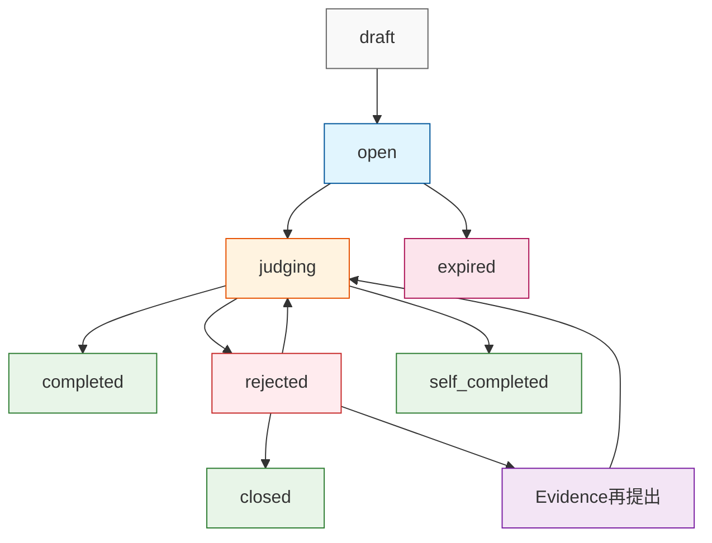
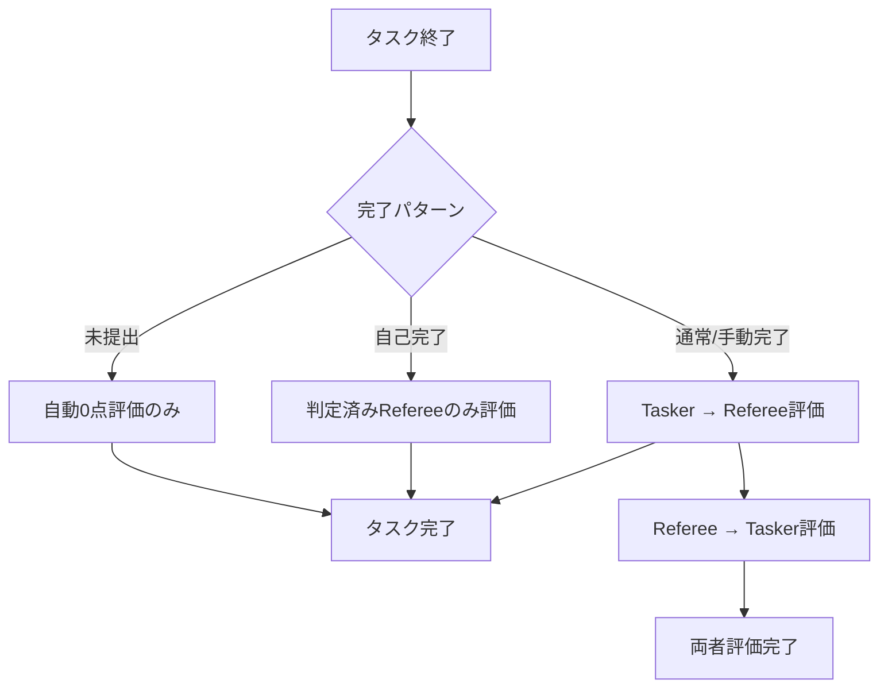

# タスク完了フロー設計仕様

## 概要
タスク完了から相互評価、報酬支払いまでの包括的なフロー設計。
すべてのステークホルダー（Tasker、Referee、システム）に適切なインセンティブを提供する。

## 完了パターン別フロー

### パターン1: 全Refereeによる承認完了
```
1. すべてのjudgementsが`approved`状態に遷移
2. tasks.status: `judging` → `completed`
3. HomeScreen: 対象タスクの縁が光る（Tasker側）
4. タップ → 承認演出表示
5. 各Refereeの結果をタップ → Referee評価（5段階、必須）
6. 全Referee評価完了 → Your tasksから削除
7. 報酬支払い実行（Referee: 90%, システム: 10%）
8. HomeScreen: 対象タスクの縁が光る（Referee側）
9. タップ → 完了演出表示
10. 評価ボタン → Tasker評価（5段階、必須）
11. 評価完了 → Referee tasksから削除
```

### パターン2: Reject混在時の手動完了
```
1. judgementに`rejected`が混在
2. tasks.status: `judging` → `rejected`
3. Tasker選択肢:
   a. Evidence再提出 → 再判定フロー（1回のみ）
   b. Close処理 → `rejected` → `closed` (手動完了へ)
4. Close処理選択時:
   - パターン1の手順4以降と同様（相互評価フロー）
```

### パターン3: Refereeタイムアウト自動完了
```
条件: Evidence提出済み かつ Due date + 1h経過
1. 未判定judgements → `expired`状態
2. tasks.status: `judging` → `self_completed`
3. Tasker自身で完了判定可能状態
4. 完了ボタン → 報酬返金: Tasker全額返金（Referee、システムへの支払い無し）
5. 判定済みRefereeのみ評価フロー実行
6. タイムアウトRefereeは自動0点評価
```

### パターン4: Evidence未提出タイムアウト
```
条件: Due date経過 かつ Evidence未提出
1. tasks.status: `open` → `expired`
2. HomeScreen: 対象タスクの縁が光る（Referee側）
3. タップ → 報酬獲得演出
4. 報酬支払い: Referee（90%）、システム（10%）
5. Taskerは自動0点評価
```

## 再判定フロー詳細設計

### Evidence再提出時の処理
```
1. Tasker: 新しいEvidenceを提出
2. システム処理:
   - tasks.status: `rejected` → `judging`
   - rejected状態のjudgementsのみ → `open`に戻す
   - approved状態のjudgementsは維持
3. 該当Refereeのみに再判定通知
4. ApprovedしたRefereeは何もしない（評価済み状態を維持）
```

### 具体例
```
初回判定結果:
- Referee A: approved ✅
- Referee B: rejected ❌
- Referee C: approved ✅

Evidence再提出後:
- Referee A: approved（維持）
- Referee B: open（再判定対象）
- Referee C: approved（維持）

→ Referee Bのみが再判定を実行
```

### データベース設計
```sql
-- 再判定対象の取得
SELECT * FROM judgements 
WHERE task_id = ? AND status = 'rejected';

-- 再判定時の状態更新
UPDATE judgements 
SET status = 'open', updated_at = NOW()
WHERE task_id = ? AND status = 'rejected';
```

## 状態遷移図



## タイムアウト設定

| 対象 | タイムアウト | 説明 |
|------|-------------|------|
| Evidence提出 | Due date | Tasker設定のDeadline |
| Referee判定 | Due date + 1h | Evidence提出後の判定期限 |

## 報酬分配

| シナリオ | Tasker | Referee | システム | 備考 |
|----------|--------|---------|----------|------|
| 通常完了 | 支払い済み | 90% | 10% | パターン1,2 |
| 自己完了 | 全額返金 | 0% | 0% | パターン3 |
| 未提出 | 支払い済み | 90% | 10% | パターン4 |

## 評価システム

### 評価仕様
- **評価方法**: 5段階（1-5点）
- **必須性**: 必須（スキップ不可）
- **自動評価**: タイムアウト時は0点
- **反映先**: `user_ratings`テーブル

### 再判定時の評価
- **ApprovedしたReferee**: 評価は初回のまま維持
- **再判定したReferee**: 最終判定後に評価
- **効率性**: 無駄な再評価を防ぐ

### 評価タイミングフロー


## UI/UX設計要素

### 視覚的フィードバック
- **縁が光る**: 重要な状態変化の通知
- **演出表示**: 承認/完了/報酬獲得の成功体験
- **プログレス表示**: 評価進捗の可視化

### 状態別UI表示

| Status | Tasker側表示 | Referee側表示 |
|--------|-------------|--------------|
| `open` | "レフェリーマッチング中" | "新しいタスク" |
| `judging` | "審査中..." | "判定してください" |
| `rejected` | "再提出が必要" | "判定完了（一部Reject）" |
| `completed` | "縁が光る → 評価画面" | "縁が光る → 評価画面" |

### 再判定時のReferee画面
```
Approved済みReferee:
- "判定完了" 表示
- 再判定ボタン無し
- 評価待ち状態

再判定対象Referee:
- "再判定してください" 表示
- 新しいEvidenceへのアクセス
- 判定ボタン表示
```

## 実装上の考慮事項

### バッチ処理
```sql
-- タイムアウト監視（1時間間隔実行）
-- 1. Evidence未提出タイムアウト
UPDATE tasks 
SET status = 'expired', updated_at = NOW()
WHERE status = 'open' 
  AND due_date < NOW();

-- 2. Referee判定タイムアウト  
UPDATE tasks 
SET status = 'self_completed', updated_at = NOW()
WHERE status = 'judging' 
  AND due_date + INTERVAL '1 hour' < NOW();

-- 3. タイムアウトjudgementsの更新
UPDATE judgements 
SET status = 'expired', updated_at = NOW()
WHERE task_id IN (
  SELECT id FROM tasks WHERE status = 'self_completed'
) AND status = 'open';
```

### トランザクション管理
- 評価完了と状態遷移の原子性
- 報酬支払い/返金の冪等性保証
- エラー時のロールバック
- 再判定時の部分更新の整合性

### 通知システム
- プッシュ通知でのアクション促進
- 締切前の事前通知
- 完了時の成功通知
- 再判定対象Refereeへの個別通知

### パフォーマンス考慮事項
- judgements状態の効率的な集計
- 再判定対象の高速特定
- 評価済みRefereeの判別ロジック

---

**作成日**: 2025年8月12日
**更新日**: 2025年8月12日
