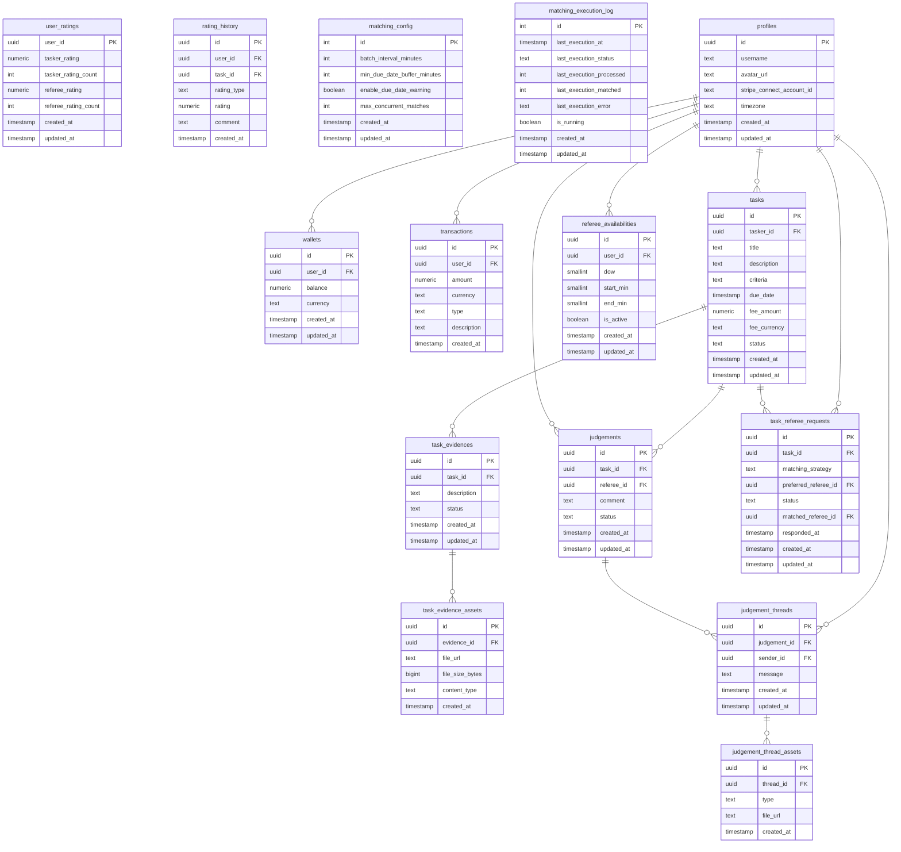
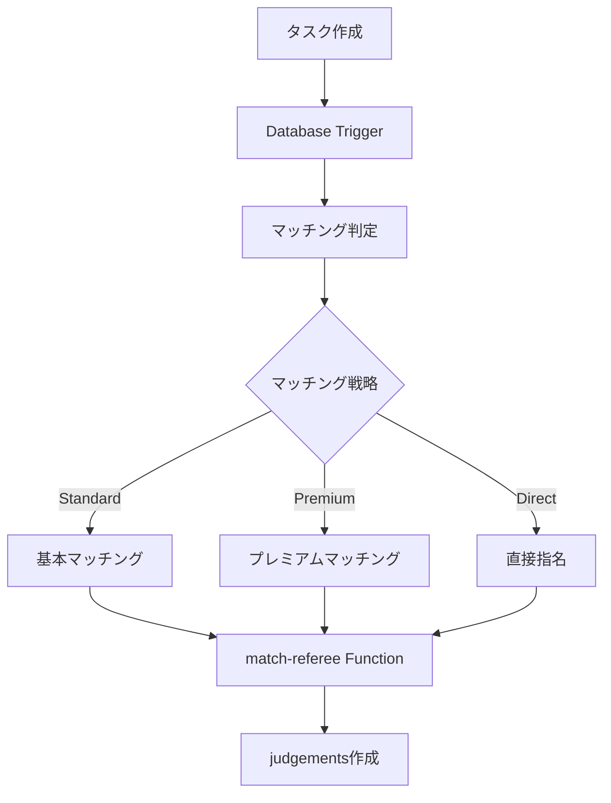

# 📃 Supabase Structure

## 📊 Database Tables



---

## ⚙️ Edge Functions

現在リポジトリに含まれているEdge Functionは以下の通りです。

### 🕒 referee-availabilities

* 目的: レフェリーの可能時間の管理（CRUD操作）
* メソッド: `GET`, `POST`, `PUT`, `DELETE`

#### GET /referee-availabilities
* 出力:
```json
{
  "availabilities": [
    {
      "id": "550e8400-e29b-41d4-a716-446655440000",
      "user_id": "UUID",
      "dow": 1,
      "start_min": 540,
      "end_min": 1020,
      "is_active": true,
      "created_at": "2024-01-01T00:00:00Z",
      "updated_at": "2024-01-01T00:00:00Z"
    }
  ]
}
```

#### POST /referee-availabilities
* 入力:
```json
{
  "dow": 1,
  "start_min": 540,
  "end_min": 1020,
  "is_active": true
}
```

### 📤 generate-upload-url

* 目的: タスクエビデンス用画像のアップロード署名付きURL生成
* 入力: タスクID、ファイル情報
* 出力: Cloudflare R2への署名付きアップロードURL
* 詳細: [functions/generate-upload-url/README.md](functions/generate-upload-url/README.md)

---

> ℹ️ 以前は `create-checkout-session`、`handle-stripe-webhook`、`process-matching`、`create-connect-link` など複数のEdge Functionを運用していましたが、2025年時点のリポジトリからは削除済みです。再度導入する場合はSupabase CLIで新規作成し、`supabase/config.toml` に節を追加してください。

---

## 🎯 レフェリーマッチングシステム

### 📋 概要

タスクが作成された際に、適切なレフェリーを自動的にマッチングするシステム。将来的にはプレミアム機能や直接指名機能に拡張可能な設計。

### 🏗️ アーキテクチャ



### 🔧 マッチング戦略

#### 1. Standard Matching (基本マッチング) ✅実装済み
- **条件**: `matching_strategy = 'standard'`
- **アルゴリズム**: タイムゾーン対応の基本マッチング
- **選択基準**:
  1. タスクdue_dateをレフェリーのタイムゾーンに変換
  2. 曜日(dow)と時間(分単位)でマッチング
  3. 現在のワークロード(judgements数)が最少のレフェリー優先
  4. 同じワークロードの場合はランダム選択

#### 2. Premium Matching (プレミアムマッチング)
- **条件**: `commitment_fee` >= 1000円
- **アルゴリズム**: 高度なマッチング
- **選択基準**:
  - 時間ベースマッチング
  - 高評価レフェリー優先
  - タスクカテゴリ適性
  - 過去実績考慮

#### 3. Direct Assignment (直接指名)
- **条件**: `preferred_referee_id` が設定済み
- **アルゴリズム**: 指定レフェリーへの直接アサイン
- **フォールバック**: 指定レフェリーが利用不可の場合はPremium Matchingに移行

### 📊 データベース設計

#### 分離されたマッチングリクエスト
```sql
-- task_referee_requests: タスクごとに複数のマッチングリクエスト可能
CREATE TABLE task_referee_requests (
    id uuid PRIMARY KEY,
    task_id uuid REFERENCES tasks(id),
    matching_strategy text DEFAULT 'standard',
    preferred_referee_id uuid REFERENCES profiles(id),
    status text DEFAULT 'pending',
    matched_referee_id uuid REFERENCES profiles(id),
    responded_at timestamp with time zone
);
```

#### 最適化されたレフェリー可用時間
```sql
-- referee_availabilities: 分単位での効率的な時間管理
CREATE TABLE referee_availabilities (
    id bigserial PRIMARY KEY,
    user_id uuid REFERENCES profiles(id),
    dow smallint CHECK (dow BETWEEN 0 AND 6),    -- 0=Sunday
    start_min smallint CHECK (start_min BETWEEN 0 AND 1439), -- 分単位
    end_min smallint CHECK (end_min BETWEEN 1 AND 1440),
    is_active boolean DEFAULT true
);
```

#### タイムゾーン対応
```sql
-- profiles: ユーザーごとのタイムゾーン情報
ALTER TABLE profiles ADD COLUMN timezone text DEFAULT 'UTC';
-- 例: 'Asia/Tokyo', 'America/New_York', 'Europe/London'
```

### ⚡ バッチ処理システム

**Database Triggerの代わりに定期バッチ処理を採用**

- **実行間隔**: 1分ごと（設定可能: `matching_config.batch_interval_minutes`）
- **実行制御**: `matching_execution_log.is_running`フラグで重複実行防止
- **バッファ**: 5秒の実行間隔バッファで浮動小数点精度問題を解決

**実装方針**:
```sql
-- 設定による動的間隔制御
SELECT last_execution_at, batch_interval_minutes
FROM matching_execution_log, matching_config
WHERE (now() - last_execution_at) >= interval '1 minute' * (batch_interval_minutes - 0.083);
```

### 🔄 process-matching Edge Function

```typescript
// タイムゾーン対応のマッチングロジック
export const findStandardMatch = async (request) => {
  // 1. タスクの due_date を取得
  const task = await getTask(request.task_id);
  const dueDate = new Date(task.due_date);

  // 2. 全レフェリーの可用時間とタイムゾーンを取得
  const availabilities = await getAvailabilities();

  // 3. タイムゾーン変換によるマッチング
  const matchedReferees = availabilities.filter(availability => {
    const refereeTimezone = availability.profiles.timezone || 'UTC';
    const taskInRefereeTimezone = new Date(dueDate.toLocaleString('en-US', {
      timeZone: refereeTimezone
    }));

    const refereeDow = taskInRefereeTimezone.getDay();
    const refereeMinutes = taskInRefereeTimezone.getHours() * 60 +
                          taskInRefereeTimezone.getMinutes();

    return refereeDow === availability.dow &&
           refereeMinutes >= availability.start_min &&
           refereeMinutes <= availability.end_min;
  });

  // 4. ワークロード分散による選択
  return selectLeastBusyReferee(matchedReferees);
};
```

### 🚀 将来拡張

- **AI マッチング**: レフェリーとタスクの適性をAIで判定
- **リアルタイム通知**: マッチング結果のプッシュ通知
- **マッチング履歴**: マッチング精度の分析・改善
- **カスタム戦略**: ユーザー独自のマッチング条件

---

## 🔐 Secrets

| 環境変数名                       | 説明                              |
| --------------------------- | ------------------------------- |
| `STRIPE_SECRET_KEY`         | Stripe API key                  |
| `STRIPE_WEBHOOK_SECRET`     | Stripe webhook signature secret |
